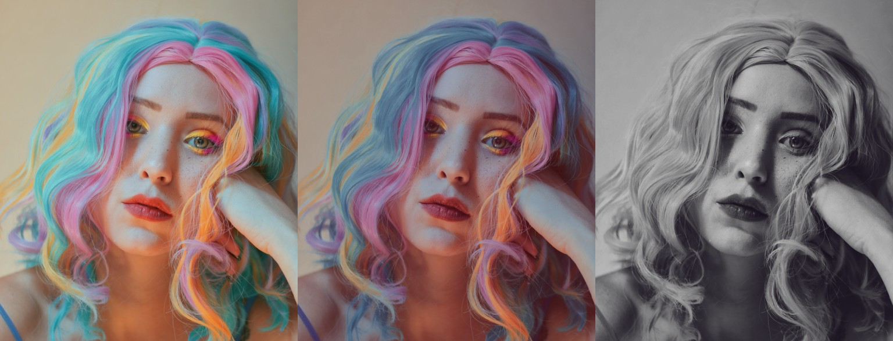

Apply LUTs
==========

.. highlight:: python
.. code-block:: python
	
	from tinycio import ColorImage

	ColorImage.load('my/image.png').lut('my/lut.cube').save('my/new_image.png')

----

If this is for a batch of images, it would be more performant to load and reuse the LUT.

.. highlight:: python
.. code-block:: python

	from tinycio import LookupTable, ColorImage

	mylut = LookupTable.load('my/lut.cube')
	im = ColorImage.load('my/image.png')
	im.lut(mylut).save('my/new_image.png')

If the LUT is meant for a particular log profile, it may be necessary to use a transfer function.

.. highlight:: python
.. code-block:: python

	from tinycio import LookupTable, ColorImage, TransferFunction

	lut = LookupTable.load('my/log_c_lut.cube')

	# Load and linearize
	im = ColorImage.load('my/image.png', 'SRGB').to_color_space('SRGB_LIN')

	# Apply desired curve
	im_log_c = TransferFunction.log_c_oetf(im)

	# Apply LUT
	im_log_c = lut.apply(im_log_c)

	# Back to linear (only if needed - a display-ready LUT should have the transform baked-in)
	im_out = TransferFunction.log_c_eotf(im)

	# Apply sRGB gamma curve (if needed) and save
	ColorImage(im_out, 'SRGB_LIN').to_color_space('SRGB').save('my/new_image.png')

Although the above hypothetically loads a 24-bit sRGB PNG file, this probably makes more sense to do with uncompressed or minimally-compressed image data, in whatever representation the LUT requires. LUTs have many uses for DCC, but processing `raw <https://github.com/ncruces/dcraw>`_ photographic image data is beyond the scope of this library.

See: :py:meth:`.ColorImage.lut`, :class:`.LookupTable`