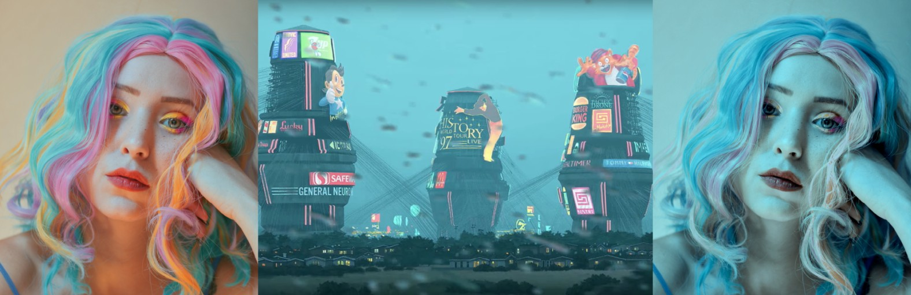
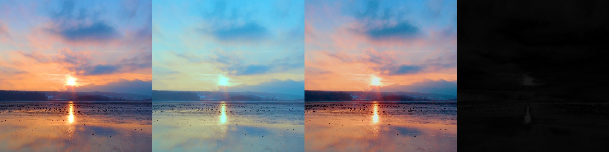
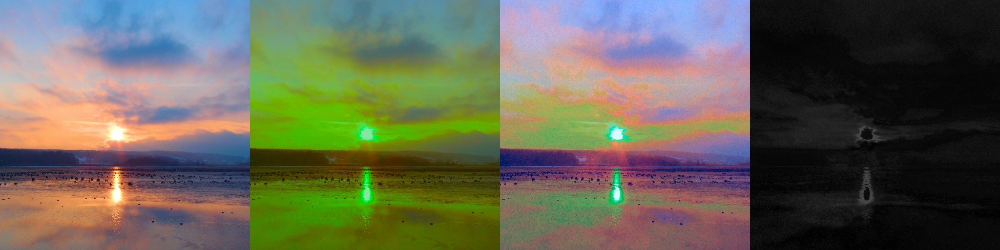
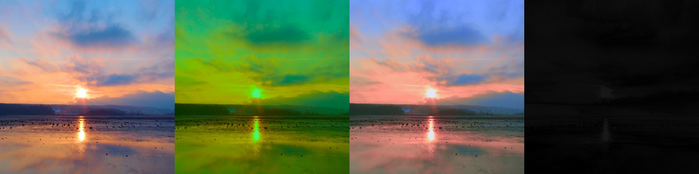
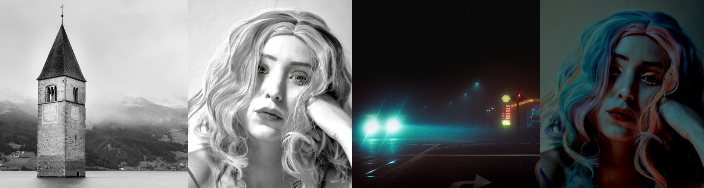
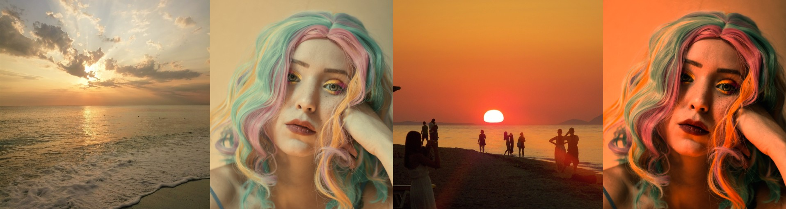
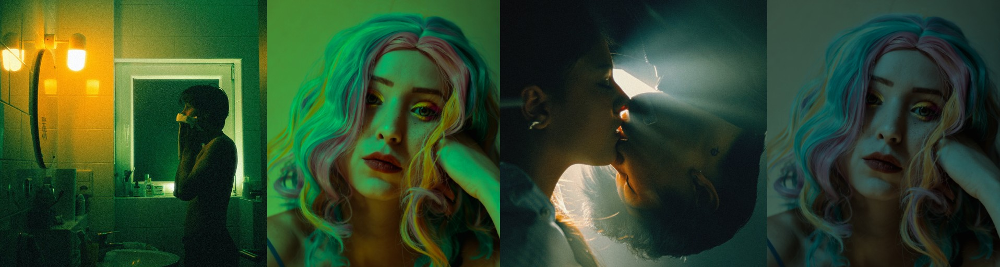
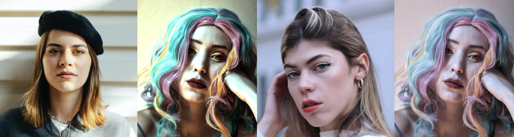

Color grade by example
======================

    
    painting by Simon Stålenhag [1]_

.. highlight:: python
.. code-block:: python

    from tinycio import ColorImage, ColorCorrection, LookupTable
    from tinycio.util import progress_bar

    im_src = ColorImage.load('my/source.exr', 'SRGB_LIN')
    im_tgt = ColorImage.load('my/target.exr', 'SRGB_LIN')
    im_src_cc = im_src.to_color_space('ACESCC')
    im_tgt_cc = im_tgt.to_color_space('ACESCC')

    # Option 1
    auto_lut = LookupTable.get_linear(size = 64)
    auto_lut.fit_to_image(im_src, im_tgt, context = progress_bar)
    auto_lut.save('my/auto_lut.cube')
    im_src.lut(auto_lut).to_color_space('SRGB').save('my/result1.png')

    # Option 2
    auto_cc = ColorCorrection()
    auto_cc.fit_to_image(im_src_cc, im_tgt_cc, context = progress_bar)
    auto_cc.save('my/auto_cc.toml')
    im_src.correct(auto_cc).to_color_space('SRGB').save('my/result2.png')

----

What this is doing
------------------

I would like to call it "differentiable color grading" -- and if that doesn't catch on, I propose 
"autograde." There is no artificial neural network involed in the process. In fact, no neural network 
is needed to perform gradient descent directly on a target. We have two such targets and, as it turns 
out, both are adequate choices with a relatively simple loss calculation. 

The first approach creates a color grading 3D LUT by aligning the appearance of a source image to that 
of a target image. The second does the same, only by optimizing color correction settings instead of 
directly optimizing a 3D LUT. 

Let's try to undo a simple transformation by fitting a LUT to the original image as target.

.. highlight:: python
.. code-block:: python

    cc = ColorCorrection()
    cc.set_color_filter(0.6, 0.25)
    cc.set_contrast(0.6)
    cc.set_exposure_bias(0.8)

    :class:`.LookupTable` optimization: source image, transformation, recovery, error (photograph by saso ucitelj [2]_)

Keep in mind that we can't rely on pixel-for-pixel comparisons. So, if we push it too far, 
this approach obviously breaks.

.. highlight:: python
.. code-block:: python

    cc = ColorCorrection()
    cc.set_color_filter(0.6, 0.25)
    cc.set_saturation(1.4)
    cc.set_shadow_color(0.3, 0.5)
    cc.set_hue_delta(0.2)

    :class:`.LookupTable` optimization: source image, transformation, recovery, error

Optimizing the color correction controls instead, on the other hand, is significantly more resilient.

    :class:`.ColorCorrection` optimization: source image, transformation, recovery, error

LUT: the brute-force approach
-----------------------------------------

Optimizing the CUBE LUT directly is straighforward:

.. highlight:: python
.. code-block:: python

    # Create a linear lookup table (output matches input one-to-one)
    auto_lut = LookupTable.get_linear(size = 64)

    # Gradient descent on LUT, with source and target images to evaluate loss
    auto_lut.fit_to_image(im_src, im_tgt, context = progress_bar)

    # Save the LUT to disk when completed
    auto_lut.save('my/auto_lut.cube')

    # Apply the LUT to the source image and save it
    im_src.lut(auto_lut).save('my/result1.png')

    :class:`.LookupTable` optimization 
    (photographs by Bruno Kraler [6]_ and Pepe Caspers [7]_ respectively)

See: :py:meth:`.LookupTable.fit_to_image`

Settings: a little finesse
-------------------------------------

The second option is to give autograd the keys and let it drive color correction:

.. highlight:: python
.. code-block:: python

    # Create a new ColorCorrection object
    auto_cc = ColorCorrection()

    # Gradient descent on settings, with source and target images to evaluate loss
    auto_cc.fit_to_image(im_src, im_tgt, context = progress_bar)

    # Save the settings to disk when completed
    auto_cc.save('my/auto_cc.toml')

    # Apply the color correction to the source and save it
    im_src.correct(auto_cc).save('my/result2.png')

    # Print out the settings
    auto_cc.info()

    # Prints e.g.:

    # CC DESCRIPTION:
    # ===============
    # CLASS            ColorCorrection
    # EXPOSURE BIAS    -0.17404550313949585
    # COLOR FILTER     [0.808641   0.81534934 0.9074043 ]
    # HUE DELTA        0.0
    # SATURATION       1.5330744981765747
    # CONTRAST         1.2529858350753784
    # SHADOW COLOR     [0.         0.         0.22277994]
    # MIDTONE COLOR    [0.16701505 0.16309454 0.        ]
    # HIGHLIGHT COLOR  [0.         0.         0.09913802]
    # SHADOW OFFSET    -0.2189391404390335
    # MIDTONE OFFSET   0.14226016402244568
    # HIGHLIGHT OFFSET 0.007211057469248772

    # And if you like:
    auto_cc.bake_lut(size = 64).save('my/auto_lut.cube')

This has a few distinct advantages:

* You can further alter the settings after optimization.
* You can save the settings as a tiny *toml* file and reuse them.
* You can still later bake a LUT of any size and in any color space you prefer.

It also overall seems to generate more plausible results.

    
    :class:`.ColorCorrection` optimization 
    (photographs by saso ucitelj [2]_)

    
    :class:`.ColorCorrection` optimization 
    (photographs by Diep Minh Chien Tran [3]_)

See: :py:meth:`.ColorCorrection.fit_to_image`

Limitations
-----------

One application for this kind of image processing is as a tool to facilitate compositing. 
The obvious disadvantage of doing this with no ANN, however, is that the optimizer is semantically 
unaware of the scene; we are treating images as mere buckets of color. As there's no image segmentation 
involved, this technique is probably best suited for, in some sense, "proposing a color palette" rather 
than trying to meaningfully match scene features.

A few problem cases are illustrated below.

    **Left**: Highlights blown out because the optimizer doesn't know the difference between faces and siding; 
    **Right**: Image desaturated trying to match hair and background color 
    (photographs by Esma Atak [4]_ and Sadettin Dogan [5]_ respectively)

.. rubric:: Footnotes

.. [1] Simon Stålenhag's `graphic novel <https://en.wikipedia.org/wiki/The_Electric_State_(graphic_novel)>`_ and `website <https://www.simonstalenhag.se/>`_
.. [2] `saso ucitelj's Pexels page <https://www.pexels.com/@saso-ucitelj-814183799/>`_
.. [3] `Diep Minh Chien Tran's Pexels page <https://www.pexels.com/@diep-minh-chien-tran-2132790/>`_
.. [4] `Esma Atak's Pexels page <https://www.pexels.com/@esma-atak-46104031/>`_
.. [5] `Sadettin Dogan's Pexels page <https://www.pexels.com/@huysuzkadraj/>`_
.. [6] `Bruno Kraler's Pexels page <https://www.pexels.com/@brunorock/>`_
.. [7] `Pepe Caspers' Pexels page <https://www.pexels.com/@pepecaspers/>`_