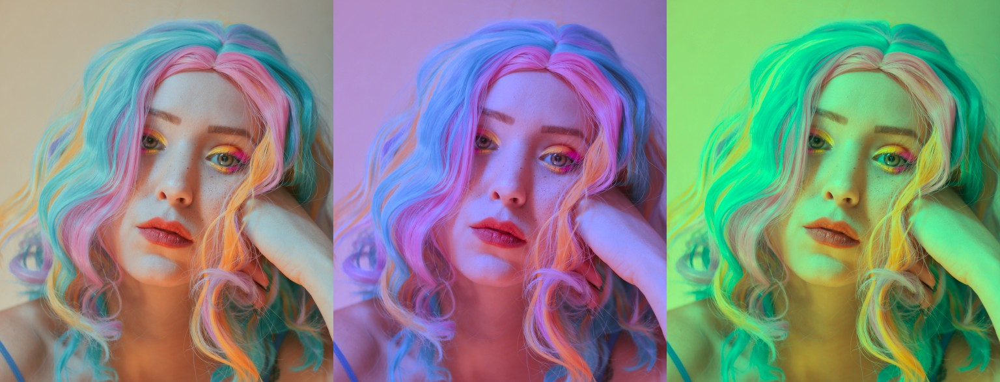
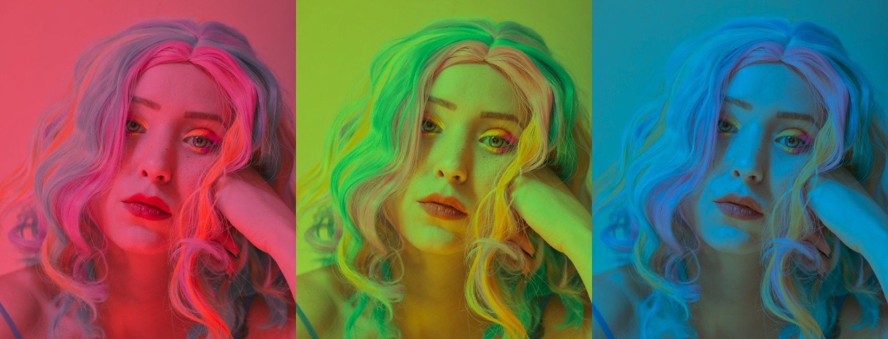
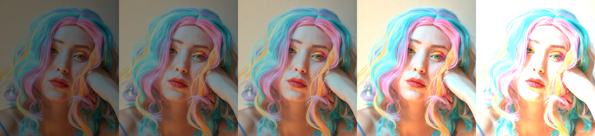
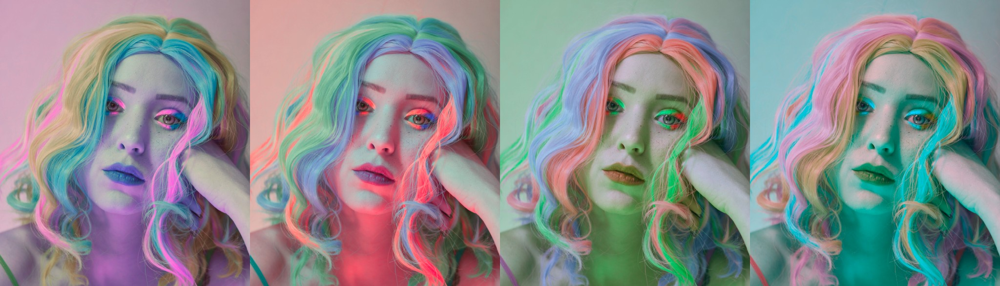
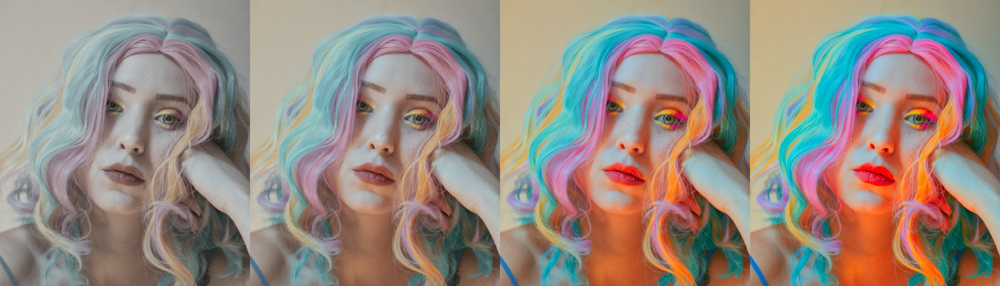
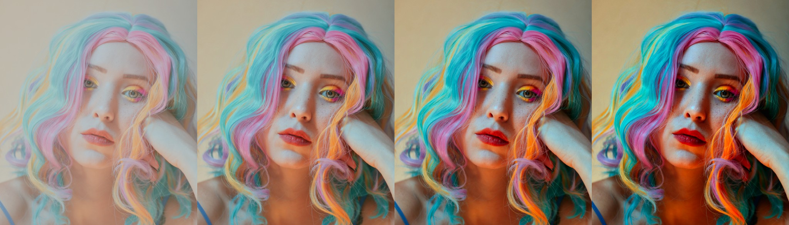
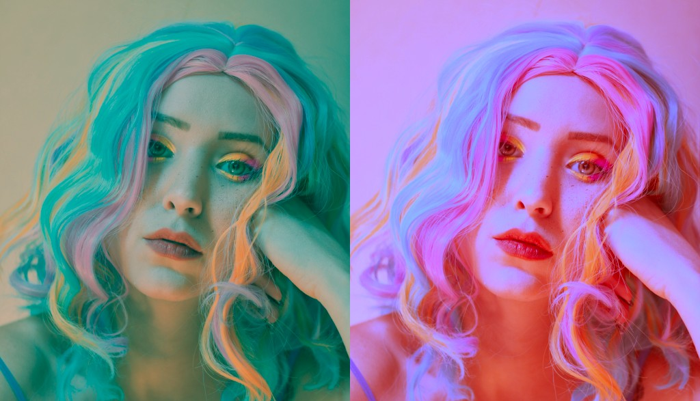

Apply basic color correction
============================

.. highlight:: python
.. code-block:: python

    from tinycio import ColorImage, ColorCorrection

    im = ColorImage.load('my/image.exr', 'SRGB_LIN')
    cc = ColorCorrection()
    cc.set_contrast(1.2)
    cc.set_saturation(0.8)
    cc.save('/my/cc_settings.toml') # if needed
    im.correct(cc).save('my/corrected_image.exr')

----

Alternatively, without :class:`.ColorImage`:

.. highlight:: python
.. code-block:: python
    
    from tinycio import ColorSpace, fsio

    im_in = fsio.load_image('my/image.exr')
    cs_in = ColorSpace.Variant.SRGB_LIN
    cs_cc = ColorSpace.Variant.ACESCC
    im_cc = ColorSpace.convert(im_in, cs_in, cs_cc)
    cc = ColorCorrection()
    cc.set_contrast(1.2)
    cc.set_saturation(1.2)
    im_corrected = cc.apply(im_cc)
    fsio.save_image(im_corrected, 'my/corrected_image.exr')

Most color correction uses *ACEScc*, so :py:meth:`.ColorCorrection.apply` expects inputs in that color space. 
:py:meth:`.ColorImage.correct` handles this conversion automatically.

Your instructions to the the :class:`.ColorCorrection` object are persistent (they change 
the instance's state rather than returning a new one) and idempotent (no difference between 
calling :py:meth:`~.ColorCorrection.set_hue_delta()` once or five times). It is recommended 
to use the setter functions as they perform color value conversions and check value ranges.

.. note::
    
    The arguments *hue* and *saturation* below are perceptually-linear values (the H and S from the OKHSV color space); 
    *hue delta* has a [-1, +1] range but also operates in OKLAB.

Color filter
------------

    Color filters at: [0, 0.5], [0.33, 0.5], [0.66, 0.5]

.. highlight:: python
.. code-block:: python

    cc = ColorCorrection()
    cc.set_color_filter(hue = 0., saturation = 0.5) # red filter

See: :py:meth:`~.ColorCorrection.set_color_filter`

Exposure bias
-------------

    Exposure bias at: -2, -1, 0, +1, +2

.. highlight:: python
.. code-block:: python

    cc = ColorCorrection()
    cc.set_exposure_bias(1) # +1 f-stop

See: :py:meth:`~.ColorCorrection.set_exposure_bias`

Hue delta
---------

    Hue delta at: -0.66, -0.33, +0.33, +0.66

.. highlight:: python
.. code-block:: python

    cc = ColorCorrection()    
    cc.set_hue_delta(-0.5) # shift hue by -0.5 (-1 and +1 are identical)

See: :py:meth:`~.ColorCorrection.set_hue_delta`

Saturation
----------

    Saturation at: 0.33, 0.66, 1.33, 1.66

.. highlight:: python
.. code-block:: python

    cc = ColorCorrection()    
    cc.set_saturation(1.3) # increase image saturation

See: :py:meth:`~.ColorCorrection.set_saturation`

Contrast
--------

    Contrast at: 0.5, 1, 1.5, 2

.. highlight:: python
.. code-block:: python

    cc = ColorCorrection()    
    cc.set_contrast(1.3) # boost contrast

See: :py:meth:`~.ColorCorrection.set_contrast`

Shadows, midtones and highlights
--------------------------------

    Shadow pulled to blue, highlights to red and vice-versa

.. highlight:: python
.. code-block:: python

    # Arbitrary values - just for example
    cc = ColorCorrection()    
    cc.set_highlight_offset(-0.02)
    cc.set_highlight_color(hue = 0.33, saturation = 0.5)
    cc.set_midtone_offset(0.022)
    cc.set_midtone_color(0.66, 0.15)
    cc.set_shadow_offset(0.1)
    cc.set_shadow_color(0., 0.08)

This is a little awkward to describe without a GUI, but if you've ever used the color wheels on 
common color grading software, you probably know what these settings do.

See: :py:meth:`.ColorImage.correct`, :class:`.ColorCorrection`