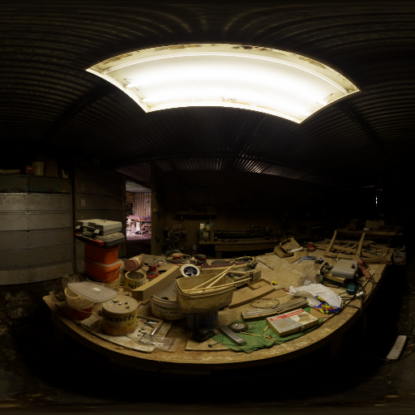

Tone map HDR images
===================

.. image:: ../images/howto_tm/tm_example.jpg
    :width: 700
    :alt: Example image with tone mapping applied

.. highlight:: python
.. code-block:: python

    from tinycio import ColorImage

    im = ColorImage.load('my/hdr_image.tif', 'SRGB_LIN')
    im.tone_map('AGX_PUNCHY', target_color_space='SRGB_LIN').save('my/ldr_image.tif')

----

:class:`.ColorImage` handles any necessary color space conversions silently. 
If you do this manually and step-by-step instead, take note of the inputs expected.

.. highlight:: python
.. code-block:: python

    from tinycio import ColorSpace, ToneMapping, fsio

    # Load HDR image from disk
    im_hdr = fsio.load_image('my/hdr_image.exr')

    cs_in = ColorSpace.Variant.SRGB_LIN
    cs_tm = ColorSpace.Variant.ACESCG
    cs_out = ColorSpace.Variant.SRGB
    tm = ToneMapping.Variant.ACESCG

    # This tone mapper expects scene-referred ACEScg data
    im_ap1 = ColorSpace.convert(im_hdr, cs_in, cs_tm)

    # Apply (fitted) ACES RRT+ODT 
    im_ldr = ToneMapping.apply(im_ap1, tone_mapper=tm)

    # Take image to sRGB and apply the gamma curve
    im_srgb = ColorSpace.convert(im_ldr, cs_tm, cs_out)

    # Save final image as 24-bit sRGB PNG file
    fsio.save_image(im_srgb, 'my/ldr_image.png')

Comparison
----------

`This HDR environment map <https://polyhaven.com/a/carpentry_shop_02>`_ was put through the different tone mapping options. 

Clamp/saturate (no tone mapping)
--------------------------------

.. image:: ../images/howto_tm/tm_clamp.png
    :width: 700
    :alt: Clamp "tone mapping"

AgX
---

AgX Punchy
----------

ACEScg (fitted)
---------------

Hable
-----

Reinhard (extended)
-------------------

.. image:: ../images/howto_tm/tm_reinhard.png
    :width: 700
    :alt: Reinhard tone mapping

See: :py:meth:`.ColorImage.tone_map`, :class:`.ToneMapping`