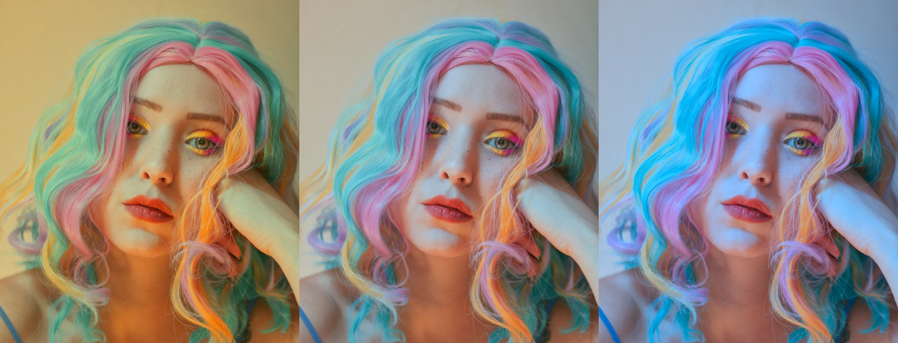

Apply white balance
===================

.. highlight:: python
.. code-block:: python

    from tinycio import ColorImage
    
    im = ColorImage.load('my/image.tif', 'SRGB_LIN')
    im = im.white_balance(source_white='auto', target_white='HORIZON')
    im.save('my/new_image.tif', graphics_format='SFLOAT16')

.. note::
    
    For specifying a white point, you can also use a correlated color temperature or :class:`.Chromaticity`.

----

While :class:`.ColorImage` will figure out the details automatically, 
there's a more explicit way to do the same, with a few more steps involved.

.. highlight:: python
.. code-block:: python

    from tinycio import fsio, WhiteBalance, ColorSpace

    cs_lin = ColorSpace.Variant.SRGB_LIN
    cs_xyz = ColorSpace.Variant.CIE_XYZ
    cs_lms = ColorSpace.Variant.LMS
    wp_target = WhiteBalance.Illuminant.HORIZON
    fmt_out = fsio.GraphicsFormat.SFLOAT16

    # Load the image
    im = fsio.load_image('my/image.tif')

    # Convert to XYZ for white point estimation
    im_xyz = ColorSpace.convert(im, cs_lin, cs_xyz)

    # Get approximate source white point
    src_white = WhiteBalance.wp_from_image(im_xyz)

    # Get xy chromaticity from standard illuminant
    tgt_white = WhiteBalance.wp_from_illuminant(wp_target)

    # Convert image to LMS for white balancing
    im_lms = ColorSpace.convert(im, cs_lin, cs_lms)

    # Apply 
    im_lms = WhiteBalance.apply(im_lms, source_white=src_white, target_white=tgt_white)

    # Convert back to sRGB linear
    im_out = ColorSpace.convert(im, cs_lms, cs_lin)

    # Finally save
    fsio.save_image(im_out, 'my/new_image.tif', graphics_format=fmt_out)

See: :py:meth:`.ColorImage.white_balance`, :class:`.WhiteBalance`